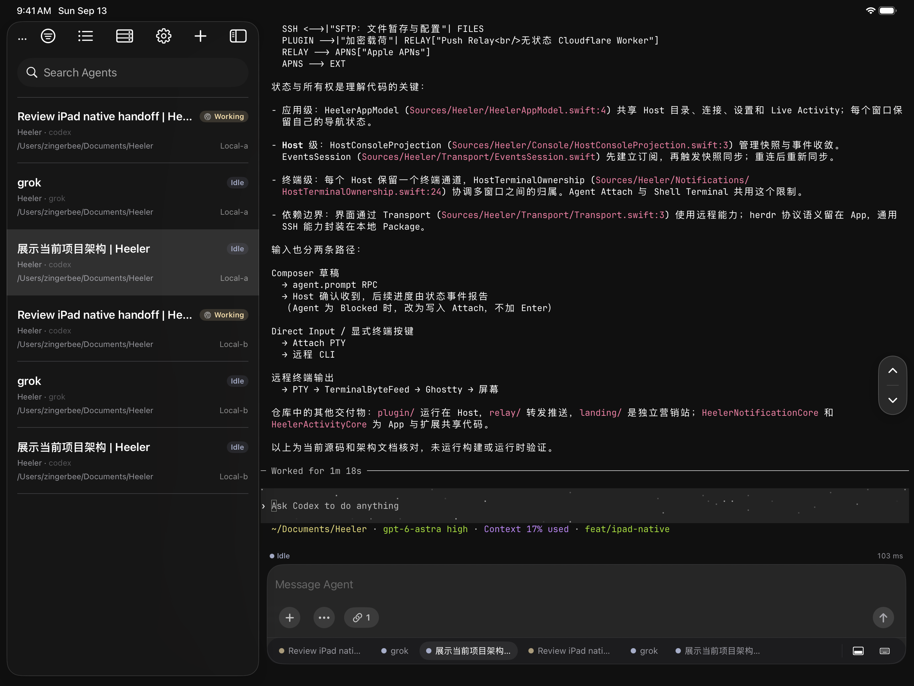
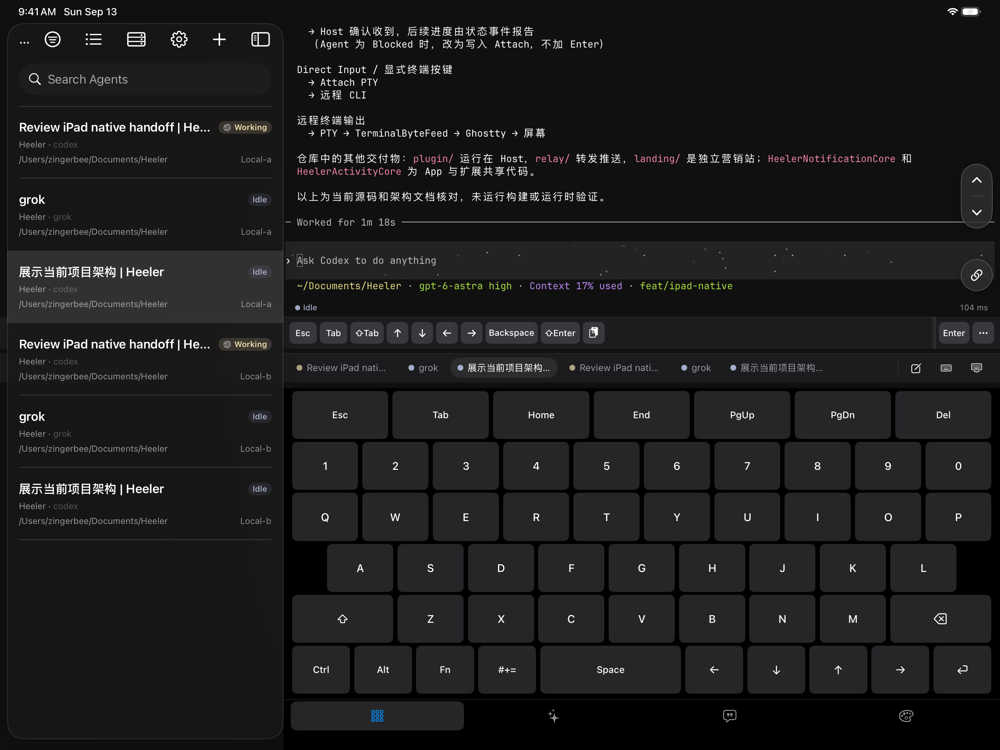
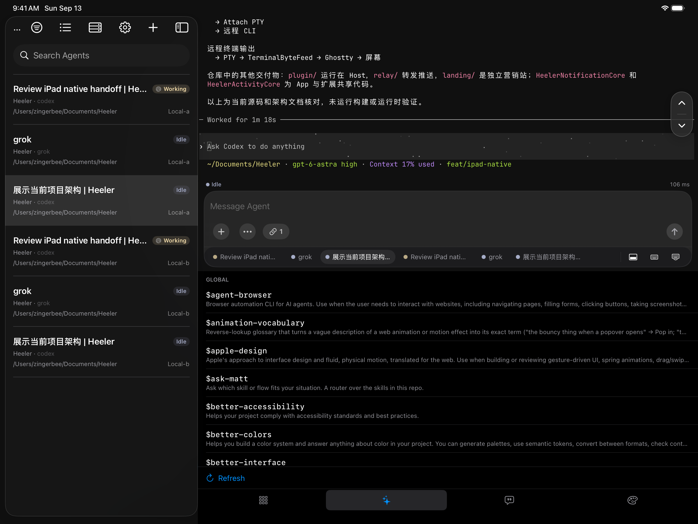
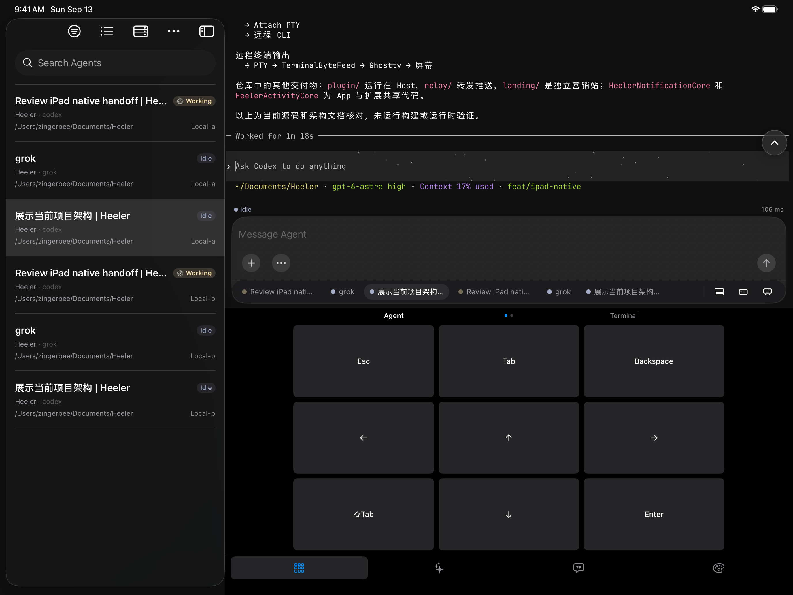
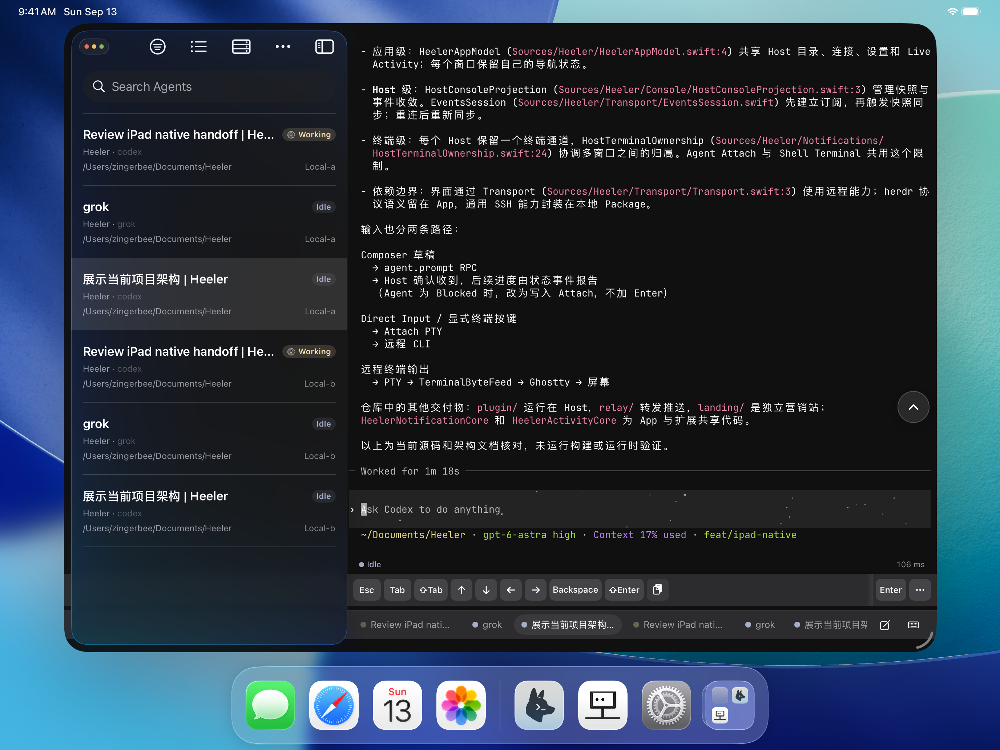

# Heeler on iPad

Agent Console, terminal input, Skills, and windowed presentation on iPad.

[Back to README](../README.md)

## Agent Console

Keep the Agent list visible alongside the selected conversation.

## Terminal keyboard

Use Direct Input with a full terminal keyboard.

## Skills

Browse Agent Skills alongside the Composer.

## Agent controls

Navigate the Agent with dedicated touch controls.

## Windowed presentation

Keep the console open in a floating iPad window.

